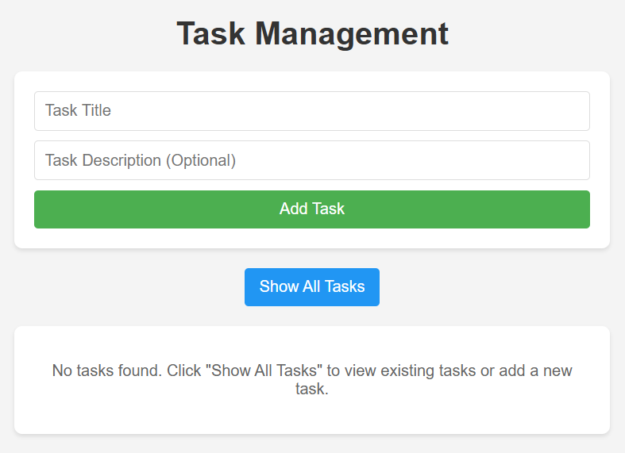
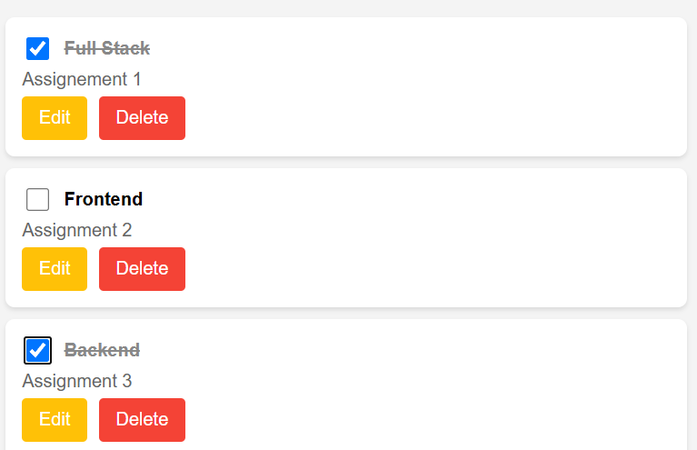
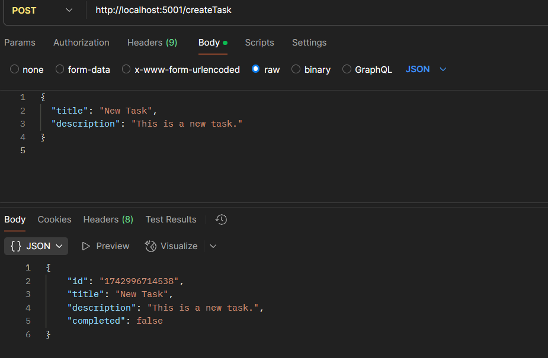
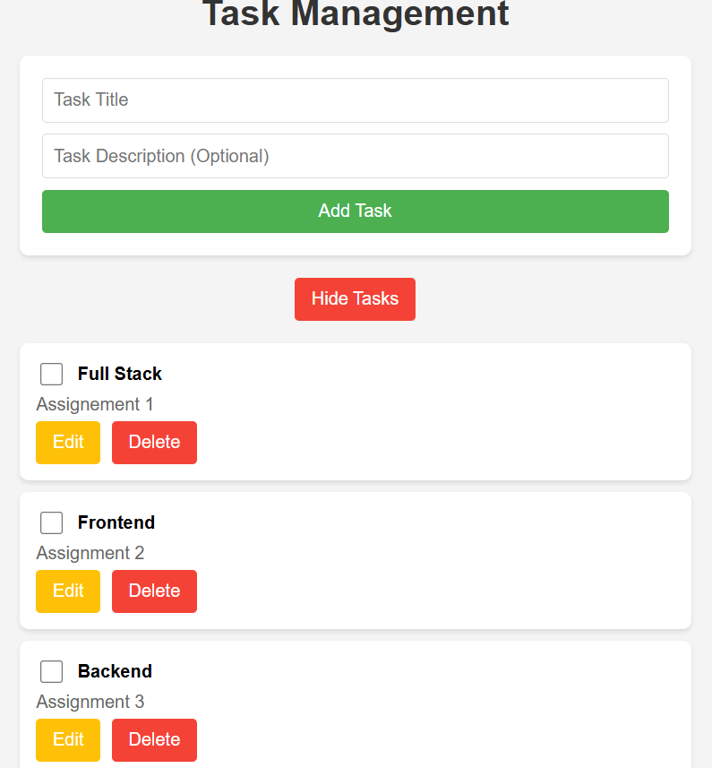
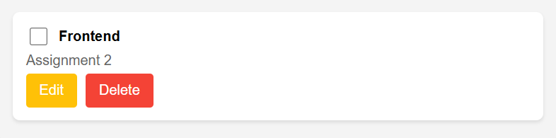
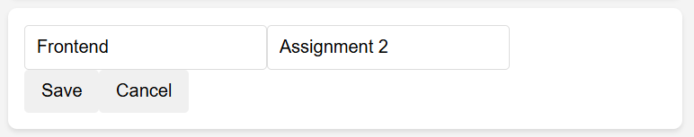

# 📝 Task Manager (Full-Stack Web Application)

This is a full-stack **Task Management Application** built using:
- **Backend:** Node.js, Express.js
- **Frontend:** React.js
- **Data Storage:** JSON file (can be replaced with a database)

Users can:
- Create tasks
- View all tasks
- Update task completion status
- Delete tasks

---

## Installation & Setup

### 🔹 Backend Setup
1. **Clone the Repository**  
   git clone https://github.com/your-username/task-manager.git
   cd task-manager/backend

2. **Install Dependencies**  
   npm install

3. **Run the Server**  
   node app.js
   - The server will start on `http://localhost:5001/`.

### 🔹 Frontend Setup
1. **Navigate to the frontend folder**  
   cd ../frontend

2. **Install Dependencies**  
   npm install

3. **Start the Frontend**  
   npm start
   - The app will open in your browser at `http://localhost:3000/`.

## 🌐 API Documentation

### 🔹 Base URL  
```
http://localhost:5001
```

### 📌 **1. Get All Tasks**
**Endpoint:**  
```
GET /getAllTasks
```
**Response:**  
```json
[
  {
    "id": "1712345678901",
    "title": "Complete project",
    "description": "Finish coding the task manager app",
    "completed": false
  }
]
```

---

### 📌 **2. Create a New Task**
**Endpoint:**  
```
POST /createTask
```
**Request Body:**  
```json
{
  "title": "Learn Node.js",
  "description": "Watch tutorial and practice"
}
```
**Response:**  
```json
{
  "id": "1712345678923",
  "title": "Learn Node.js",
  "description": "Watch tutorial and practice",
  "completed": false
}
```

---

### 📌 **3. Update a Task**
**Endpoint:**  
```
PUT /updateTask/:id
```
**Request Body (Partial Update Allowed):**  
```json
{
  "completed": true
}
```
**Response:**  
```json
{
  "id": "1712345678923",
  "title": "Learn Node.js",
  "description": "Watch tutorial and practice",
  "completed": true
}
```

---

### 📌 **4. Delete a Task**
**Endpoint:**  
```
DELETE /deleteTask/:id
```
**Response:**  
```json
{
  "id": "1712345678923",
  "title": "Learn Node.js",
  "description": "Watch tutorial and practice",
  "completed": true
}
```

---

## 🛠️ Testing the API

### ✅ **Using cURL (Command Line)**
#### 🔹 Get All Tasks
```bash
curl http://localhost:5000/getAllTasks
```
#### 🔹 Create a Task
```bash
curl -X POST -H "Content-Type: application/json"   -d '{"title": "New Task", "description": "This is a test"}'   http://localhost:5000/createTask
```
#### 🔹 Update a Task (Replace `<id>` with actual task ID)
```bash
curl -X PUT -H "Content-Type: application/json"   -d '{"completed": true}'   http://localhost:5000/updateTask/<id>
```
#### 🔹 Delete a Task (Replace `<id>` with actual task ID)
```bash
curl -X DELETE http://localhost:5000/deleteTask/<id>
```

---

### ✅ **Using Postman**
1. **Open Postman** and create a new request.
2. **Set the Request Type:**  
   - `GET` → `http://localhost:5000/getAllTasks`
   - `POST` → `http://localhost:5000/createTask`
   - `PUT` → `http://localhost:5000/updateTask/<id>`  
   - `DELETE` → `http://localhost:5000/deleteTask/<id>`
3. **For POST & PUT Requests:**  
   - Go to `Body` → Select `raw` → Choose `JSON` format.
   - Add the JSON request body.
4. **Click "Send"** and check the response.

---






